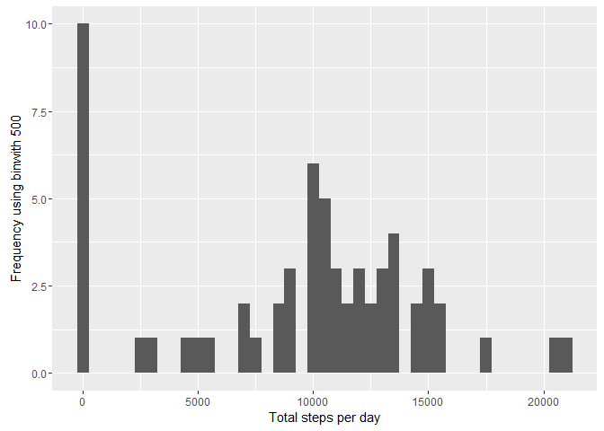

# Reproducible Research: Peer Assessment 1
## Load libraries used in analysis

```r
library(dplyr)
```

```
## 
## Attaching package: 'dplyr'
```

```
## The following objects are masked from 'package:stats':
## 
##     filter, lag
```

```
## The following objects are masked from 'package:base':
## 
##     intersect, setdiff, setequal, union
```

```r
library(ggplot2)
```

```
## Warning: package 'ggplot2' was built under R version 3.2.4
```

## Loading and preprocessing the data
Step 1. load csv into data frame

```r
actDS <- read.csv("activity/activity.csv", header=TRUE, sep=",")
```
Step 2. Summarise data, find Total, mean and median steps per day

```r
actSummary <- actDS %>% group_by(date) %>% summarise(totalSteps = sum(steps), 
                                                     meanSteps = mean(steps), 
                                                     medianSteps = median(steps))
```


## What is mean total number of steps taken per day?
Step 3. Plot as Histogram the total number of steps taken per day


```r
qplot(totalSteps, data=actSummary) + labs(title = "Total number of steps per day")
```

```
## `stat_bin()` using `bins = 30`. Pick better value with `binwidth`.
```

```
## Warning: Removed 8 rows containing non-finite values (stat_bin).
```




```r
qplot(meanSteps, data=actSummary) 
```

```
## `stat_bin()` using `bins = 30`. Pick better value with `binwidth`.
```

```
## Warning: Removed 8 rows containing non-finite values (stat_bin).
```


```r
qplot(medianSteps, data=actSummary) 
```

```
## `stat_bin()` using `bins = 30`. Pick better value with `binwidth`.
```

```
## Warning: Removed 8 rows containing non-finite values (stat_bin).
```


## What is the average daily activity pattern?

```r
qplot(date, meanSteps, data=actSummary, geom = "line") 
```

```
## geom_path: Each group consists of only one observation. Do you need to
## adjust the group aesthetic?
```


```r
#plot(meanSteps, type = "l")
```

## Imputing missing values


## Are there differences in activity patterns between weekdays and weekends?
