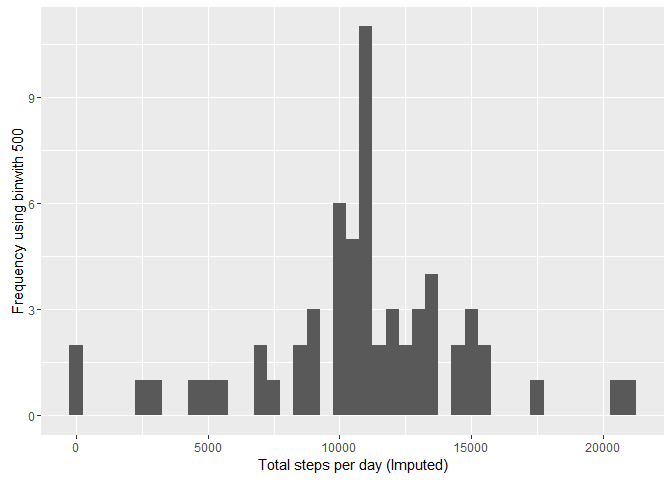

# Reproducible Research: Peer Assessment 1
Terry Grimaldi  
10 May 2016  

## Load libraries used by this analysis  

```r
#R chunk suppresses warning message. Loaded libraries are built on R3.2.4 or 3.2.5. R version used in this
#assignmet is 3.2.3.
library(dplyr)
library(ggplot2)
library(Hmisc)
library(scales)
library(rmarkdown)
```

##Loading and preprocessing the data

1. Load the data (i.e. read.csv())


```r
if(!file.exists('activity.csv')){
    unzip('activity.zip')
}

activityData <- read.csv('activity.csv', header=TRUE, sep=",")
```
2. Process/transform the data (if necessary) into a format suitable for your analysis
* no preprocessing or transformation of data was performed.

##What is mean total number of steps taken per day?

1. Calculate the total number of steps taken per day  

```r
stepsPerDay <- tapply(activityData$steps, activityData$date, sum, na.rm=TRUE)
```
2. Make a histogram of the total number of steps taken each day


```r
qplot(stepsPerDay, xlab='Total steps per day', ylab='Frequency using binwith 500', binwidth=500)
```

<!-- -->

3. Calculate and report the mean and median total number of steps taken per day


```r
stepsPerDayMean <- mean(stepsPerDay)
stepsPerDayMedian <- median(stepsPerDay)
```
* Mean Steps/Day: **9354.2295082**
* Median Steps/Day: **10395**

##What is the average daily activity pattern?

1. Make a time series plot  
* First find the average steps per day and save to new dataset before constructing the time series plot.

```r
averageStepsPerTimeBlock <- aggregate(x=list(meanSteps=activityData$steps), by=list(interval=activityData$interval), FUN=mean, na.rm=TRUE)
```

* Now construct the plot.  

```r
ggplot(data=averageStepsPerTimeBlock, aes(x=interval, y=meanSteps)) +
    geom_line() +
    xlab("5-minute interval") +
    ylab("average number of steps taken") 
```

<!-- -->
  
2. Which 5-minute interval, on average across all the days in the dataset, contains the maximum number of steps?


```r
mostSteps <- which.max(averageStepsPerTimeBlock$meanSteps)
timeMostSteps <-  gsub("([0-9]{1,2})([0-9]{2})", "\\1:\\2", averageStepsPerTimeBlock[mostSteps,'interval'])
```
  
* Most Steps: **104** at time **8:35**

##Imputing missing values  
1. Calculate and report the total number of missing values in the dataset


```r
numMissingValues <- length(which(is.na(activityData$steps)))
```
  
* The number oif missing values is: **2304**

2. Devise a strategy for filling in all of the missing values in the dataset.

3. Create a new dataset that is equal to the original dataset but with the missing data filled in.  
* Code for points 2 and 3...  


```r
activityDataImputed <- activityData
activityDataImputed$steps <- impute(activityData$steps, fun=mean)
```
4. Make a histogram of the total number of steps taken each day. Do these values differ from the estimates from the first part of the assignment? What is the impact of imputing missing data on the estimates of the total daily number of steps?


```r
stepsPerDayImputed <- tapply(activityDataImputed$steps, activityDataImputed$date, sum)
qplot(stepsPerDayImputed, xlab='Total steps per day (Imputed)', ylab='Frequency using binwith 500', binwidth=500)
```

<!-- -->
  
... and Calculate and report the **mean** and **median** total number of steps taken per day.


```r
stepsPerDayMeanImputed <- mean(stepsPerDayImputed)
stepsPerDayMedianImputed <- median(stepsPerDayImputed)
```
  
* Mean steps/Day(Imputed): **1.0766189\times 10^{4}**  
* Median steps/Day(Imputed): **1.0766189\times 10^{4}**  

The variation between inital mean and median values calculated and the imputed mean and median values is:  

* mean variation: **15.0943396 %**  
* median variation: **3.5708387 %**  

##Are there differences in activity patterns between weekdays and weekends?
1. Create a new factor variable in the dataset with two levels - **weekday** and **weekend** indicating whether a given date is a weekday or weekend day.


```r
activityDataImputed$dateType <-  ifelse(as.POSIXlt(activityDataImputed$date)$wday %in% c(0,6), 'weekend', 'weekday')
```

2. Make a panel plot containing a time series plot


```r
averagedActivityDataImputed <- aggregate(steps ~ interval + dateType, data=activityDataImputed, mean)
ggplot(averagedActivityDataImputed, aes(interval, steps)) + 
    geom_line() + 
    facet_grid(dateType ~ .) +
    xlab("5-minute interval") + 
    ylab("avarage number of steps")
```

<!-- -->


